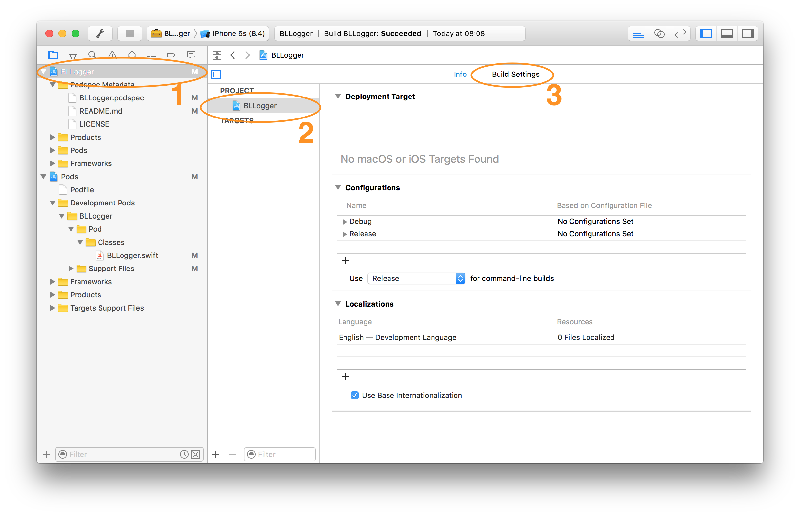
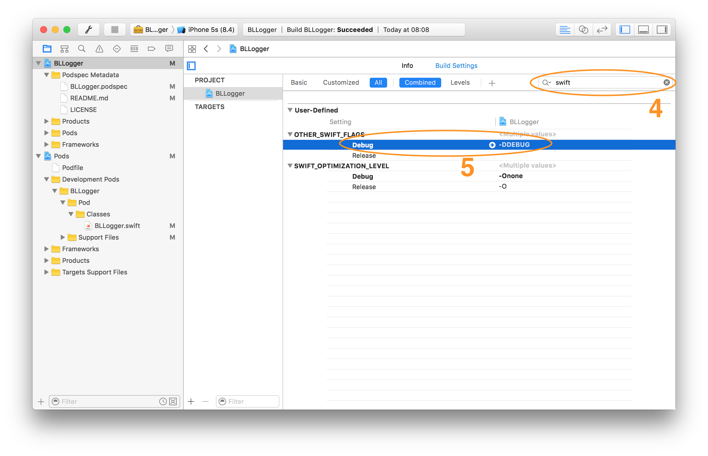

# BLLogger

A Swift dLog implementation.

_v0.7.1_

## Requirements

* Xcode
* Swift 3.0

## Usage

* After installing and configuring BLLogger:

``` swift
func someFunction() {
    dLog("This message will appear on your console when you're in debug mode")
    aLog("This message will always appear on your console")
}
```

## Configuration

1. Install BLLogger
2. Add the Swift degub flag to your project




    2.1. Select your project on the Project navigator
    2.2. Select your project on the Target list
    2.3. Select the Build Settings tab
    2.4. Search for `other swift flags`
    2.5. Add `-DDEBUG` to your `debug` scheme

## Installation

### Cocoapods

Because of [this](http://stackoverflow.com/questions/39637123/cocoapods-app-xcworkspace-does-not-exists), I've dropped support for Cocoapods on this repo. I cannot have production code rely on a dependency manager that breaks this badly. 

### Git Submodules

**Why submodules, you ask?**

Following [this thread](http://stackoverflow.com/questions/31080284/adding-several-pods-increases-ios-app-launch-time-by-10-seconds#31573908) and other similar to it, and given that Cocoapods only works with Swift by adding the use_frameworks! directive, there's a strong case for not bloating the app up with too many frameworks. Although git submodules are a bit trickier to work with, the burden of adding dependencies should weigh on the developer, not on the user. :wink:

To install BLLogger using git submodules:

```
cd toYourProjectsFolder
git submodule add -b submodule --name BLLogger https://github.com/BellAppLab/BLLogger.git
```

**Swift 2 support**

```
git submodule add -b swift2 --name BLLogger https://github.com/BellAppLab/BLLogger.git
```

Then, navigate to the new BLLogger folder and drag the `Source` folder into your Xcode project.

## Author

Bell App Lab, apps@bellapplab.com

## License

BLLogger is available under the MIT license. See the LICENSE file for more info.
